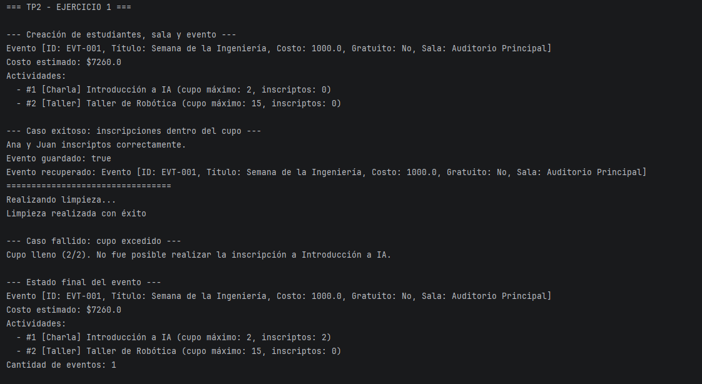
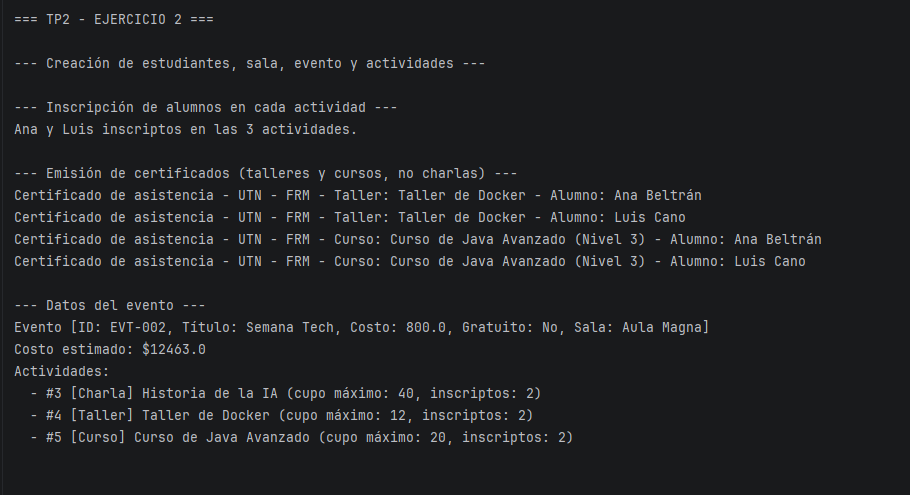
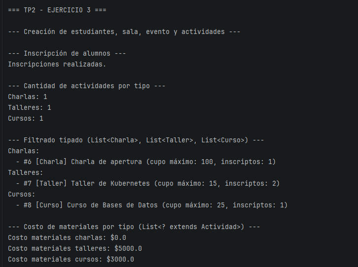
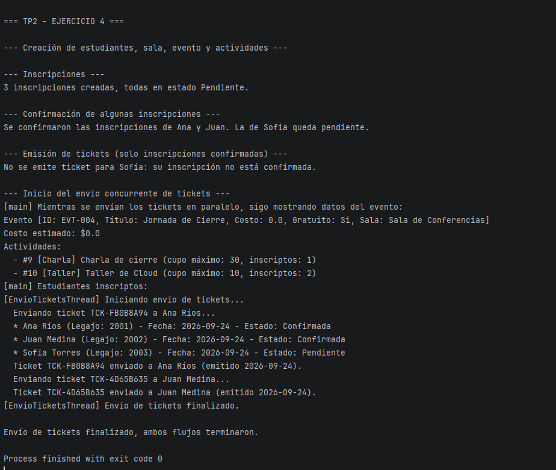

## Cómo ejecutar
```bash
git clone https://github.com/federicocent/PP-TP2-53323
cd PP-TP2-53323
```

Abrir el proyecto en IntelliJ IDEA y ejecutar `App.java` . Ejecuta los 4 ejercicios en orden, uno atrás del otro, cada uno con sus propios datos de prueba armados en el código. No requiere ingresar nada por teclado.

### Captura de una ejecución





